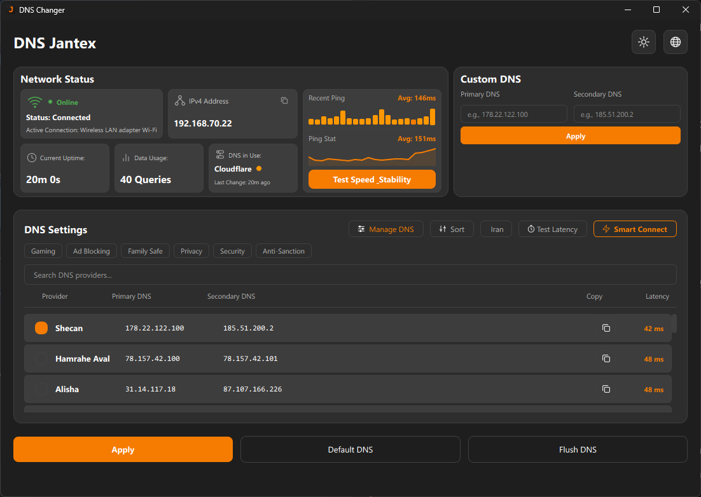

<p align="center">
  
</p>

<h1 align="center">DNS Jantex</h1>

<p align="center">
  A modern Windows DNS management app with 50+ providers, latency testing, search/filter, and Persian support.
</p>

---

## Features

- **50+ DNS providers** — Google, Cloudflare, Quad9, AdGuard, and many more
- **Iran DNS filter** — quick access to local providers (Shecan, Hamrahe Aval, Electro, etc.)
- **Latency test** — ping all providers to find the fastest one for your connection
- **Search & filter** — find any DNS provider instantly by name or IP
- **Sort by speed** — toggle between lowest/highest latency
- **Custom DNS** — add your own DNS servers
- **Dark & light themes** — switch with one click
- **English & Persian** — full Farsi language support with RTL layout
- **One-click apply** — fast DNS switching with instant confirmation
- **Flush & reset** — clear DNS cache or restore automatic (DHCP) settings
- **Installer** — desktop and Start Menu shortcuts included

## Screenshots

<p align="center">
  
  <br>
  <em>Dark mode</em>
</p>

## Download

Download the latest installer from [Releases](https://github.com/ZeLoExE/dns-jantex/releases).

## Requirements

- Windows 10/11
- Administrator privileges (required to change DNS settings)

## Installation

1. Download `DNSJantex-Setup.exe` from [Releases](https://github.com/ZeLoExE/dns-jantex/releases)
2. Run the installer as Administrator
3. Follow the setup wizard

## Usage

1. Run `DNSChanger.exe` as Administrator
2. Search or browse for a DNS provider
3. Click **Apply** to set the DNS
4. Use **Test Latency** to compare speeds
5. Use **Default DNS** to reset to automatic

## Building from Source

```bash
# Install dependencies
pip install -r requirements.txt

# Run directly
python main.py

# Build executable
pyinstaller build.spec

# Build installer (requires NSIS)
makensis installer.nsi
```

## Project Structure

```
dns-jantex/
├── main.py                 # Application entry point
├── ui/                     # User interface
│   ├── main_window.py      # Main window
│   ├── components.py       # UI components
│   ├── styles.py           # Themes and styles
│   └── custom_dns_dialog.py
├── core/                   # Core logic
│   ├── dns_manager.py      # DNS operations
│   ├── dns_providers.py    # Provider list (50+)
│   ├── network_adapter.py  # Network detection
│   └── custom_dns.py       # Custom DNS storage
├── translations/           # Language files
│   ├── en.json
│   └── fa.json
├── assets/                 # Icons and images
├── build.spec              # PyInstaller config
└── installer.nsi           # NSIS installer script
```

## License

MIT License - see [LICENSE.txt](LICENSE.txt)

## Credits

Built with [PySide6](https://doc.qt.io/qtforpython-6/) and [NSIS](https://nsis.sourceforge.io/).
