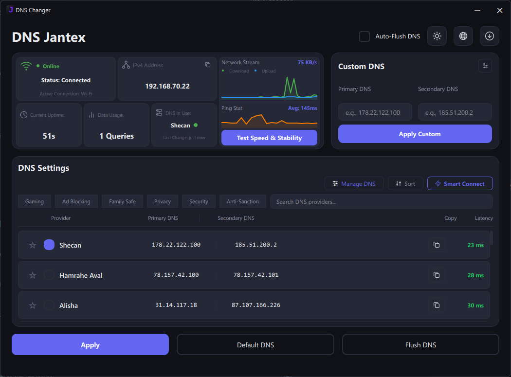

<p align="center">
  
</p>

<h1 align="center">DNS Jantex</h1>

<p align="center">
  A modern Windows DNS management app with 70+ providers, latency testing, Smart Connect, system tray, auto-updater, and Persian support.
</p>

---

## Features

- **70+ DNS providers** — Google, Cloudflare, Quad9, AdGuard, OpenDNS, Norton, Level3, and many more
- **Smart Connect** — one-click benchmark that auto-selects the fastest provider
- **Tag filters** — filter providers by Gaming, Ad Blocking, Family Safe, Privacy, Security, or Anti-Sanction
- **Favorites system** — star your most-used DNS providers to pin them to the top of the list
- **Sticky search bar** — search stays accessible as you scroll through the provider list
- **Custom DNS presets** — save frequently used manual DNS inputs for quick access
- **Network Stream graph** — real-time bandwidth monitor showing upload/download speed
- **Ping Stat chart** — line chart tracking latency history over time
- **DNS analytics** — live uptime, success rate, and query count displayed in real time
- **Status indicator** — green/yellow/red dot shows DNS health at a glance
- **Auto-Flush DNS** — optionally flush DNS cache automatically after every Apply
- **System tray** — minimize to tray, double-click to restore, right-click context menu
- **Auto-updater** — checks GitHub Releases for new versions, downloads and installs silently
- **Dark & light themes** — switch with one click, fully theme-aware UI
- **English & Persian** — full Farsi language support with RTL layout
- **One-click apply** — fast DNS switching with instant confirmation
- **Flush & reset** — clear DNS cache or restore automatic (DHCP) settings
- **Manage DNS modal** — add, edit, and delete custom DNS entries with a unified data store
- **Installer** — desktop and Start Menu shortcuts included
- **Frameless window** — modern custom title bar with native Windows 11 shadow and rounded corners
- **Custom dialog system** — themed frameless dialogs replacing native message boxes

## Screenshots

<p align="center">
  
  <br>
  <em>Dark mode with latency testing</em>
</p>

<p align="center">
  
  <br>
  <em>Preferences menu with toggle switches and dropdown</em>
</p>

## Download

Download the latest installer from [Releases](https://github.com/ZeLoExE/dns-jantex/releases).

## Requirements

- Windows 10/11
- Administrator privileges (required to change DNS settings)
- Python 3.10+ (for building from source)
- psutil (for network bandwidth monitoring)

## Installation

1. Download `DNSJantex-Setup.exe` from [Releases](https://github.com/ZeLoExE/dns-jantex/releases)
2. Run the installer as Administrator
3. Follow the setup wizard

## Usage

1. Run `DNSChanger.exe` as Administrator
2. Click **Smart Connect** to auto-find the fastest DNS, or browse the list
3. Click **Apply** to set the DNS
4. Use **Default DNS** to reset to automatic
5. Star your favorite providers for quick access
6. Use the search bar to find any DNS by name or IP address
7. Save custom DNS presets from the Custom DNS card
8. Minimize to system tray — app keeps running in the background
9. Check for updates via the update button in the header

## Building from Source

```bash
# Install dependencies
pip install -r requirements.txt

# Run directly
python main.py

# Build executables (DNSChanger.exe + Updater.exe)
build.bat

# Build installer (requires NSIS)
makensis installer.nsi
```

## Project Structure

```
dns-jantex/
├── main.py                 # Application entry point
├── updater.py              # Standalone updater script
├── VERSION                 # Current version string
├── ui/                     # User interface
│   ├── main_window.py      # Main window + system tray + updater UI
│   ├── components.py       # UI components (DNSCard, NetworkInfoCard, etc.)
│   ├── styles.py           # Themes and styles
│   └── custom_dns_dialog.py
├── core/                   # Core logic
│   ├── dns_manager.py      # DNS operations
│   ├── dns_providers.py    # Provider list (70+)
│   ├── network_adapter.py  # Network detection
│   ├── custom_dns.py       # Custom DNS persistent storage
│   ├── profiler.py         # Performance profiling utilities
│   └── updater.py          # Update checker (GitHub Releases API)
├── translations/           # Language files
│   ├── en.json
│   └── fa.json
├── assets/                 # Icons and images
│   └── icons/              # SVG icon set
├── build.bat               # Build script (app + updater)
├── build.spec              # PyInstaller config for main app
├── build_updater.spec      # PyInstaller config for updater
└── installer.nsi           # NSIS installer script
```

## What's New in v2.7.0

- **Improved error handling** — bare `except Exception` replaced with specific types (`AttributeError`, `OSError`, `TypeError`, `ValueError`) across core modules
- **Structured logging** — profiling output now uses `logging.debug()` gated behind `DNS_JANTEX_DEBUG_PERF` env var; no more `print()` to stderr in production
- **Code cleanup** — removed duplicate imports, `__import__` hacks, and unused imports across core modules
- **Data integrity** — removed duplicate IBM Quad9 DNS provider entry
- **Overall quality** — zero warnings across full code review

## What's New in v2.6

- **Startup performance** — DNS info loading moved to background thread; window appears instantly
- **Faster DNS operations** — set DNS + flush combined into a single PowerShell command (3x fewer process spawns)
- **Adapter name caching** — avoids re-querying the active adapter on every operation
- **Live uptime display** — uptime counter updates every second without network overhead
- **SVG icon caching** — icons rendered once and reused, reducing startup time
- **Proper update icon** — replaced chart icon with arrow-down-circle for "Check for Updates"
- **Dashboard centering** — network info card values now center-aligned for a cleaner layout
- **DNS in Use centering** — provider name and status dot centered as a single group

## What's New in v2.5

- **System tray** — minimize to tray instead of taskbar; double-click tray icon to restore, right-click for context menu (Open / Exit)
- **Auto-updater** — checks GitHub Releases on startup (configurable), downloads installer in background, launches standalone Updater.exe for silent install
- **Standalone Updater.exe** — waits for main app exit, runs NSIS installer silently, relaunches the updated app, cleans up temp files
- **Update button** — new header button to manually check for updates with progress feedback
- **70+ DNS providers** — added Norton, Level3 variants, Dyn, Qwest, UltraDNS, Zen Internet, Orange DNS, Neustar, DNS4EU, Sprint, Sprintlink, DNS WATCH, Freenom World, FDN, and more
- **Tag-based filtering** — all new providers tagged for Gaming, Security, Privacy, etc.
- **PyInstaller path fixes** — correct resource resolution in bundled executables (read-only vs writable paths)
- **Light mode fix** — update button icon now adapts to the current theme

## What's New in v2.4

- **Frameless window** — native Windows 11 look with rounded corners, DWM shadow, and custom title bar
- **Custom title bar** — app icon, title, minimize and close buttons with Windows 11 hover effects
- **Window dragging** — drag the title bar to reposition the window
- **Custom dialogs** — themed frameless success/error/warning dialogs with fade-in animation and centered positioning
- **Fixed dialog centering** — dialogs now always appear centered over the main window
- **Fixed window sizing** — non-resizable window with optimized layout for DNS list visibility

## What's New in v2.0

- **Favorites system** — star providers to pin them to the top
- **Network Stream graph** — real-time bandwidth monitoring
- **Sticky search** — search bar stays visible while scrolling
- **Custom DNS presets** — save and reuse manual DNS inputs
- **Auto-Flush DNS** — optional automatic cache flush after Apply
- **Light mode fixes** — fully working light theme with proper contrast
- **Unified data store** — Custom DNS presets and Manage DNS share one backend
- **Two-row action bar** — cleaner layout with tags and buttons separated
- **Removed redundant controls** — Test Latency button removed (covered by Test Speed & Stability)
- **Improved typography** — larger fonts, better spacing, no text clipping

## Support

If you find DNS Jantex useful, consider supporting the development:

[](https://daramet.com/ZeLoExE)

## License

MIT License - see [LICENSE.txt](LICENSE.txt)

## Credits

Built with [PySide6](https://doc.qt.io/qtforpython-6/), [psutil](https://github.com/giampaolo/psutil), and [NSIS](https://nsis.sourceforge.io/).
